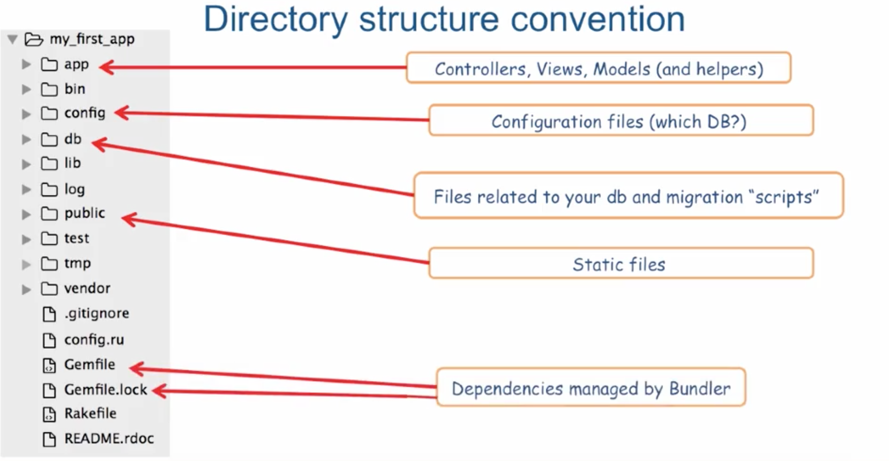
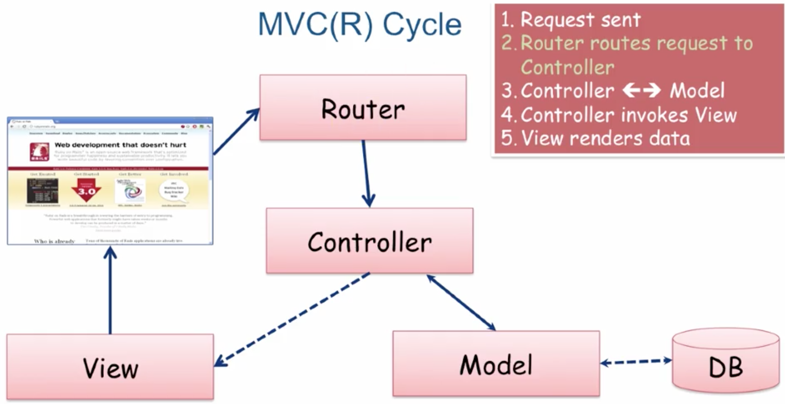
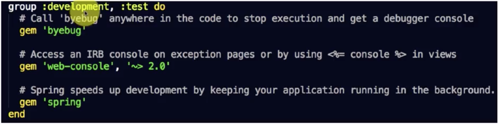
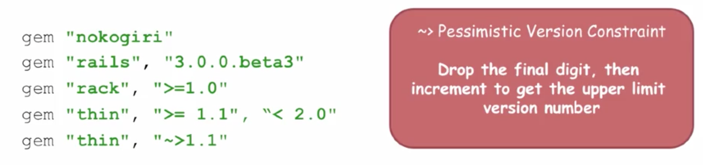
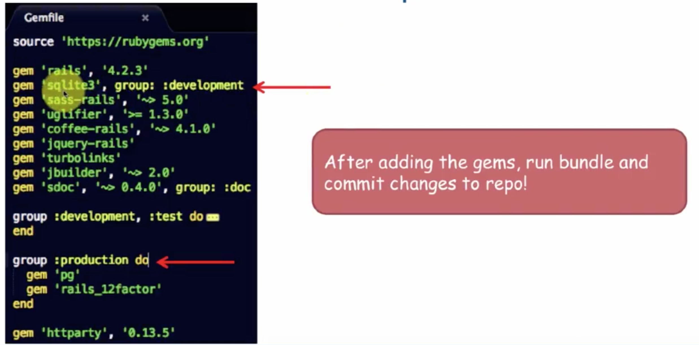

Rails - create an app
---------------------

### On the terminal:

```
rails new my_app //creates a new app
cd my_app
git init
git add .
git commit -m "Initial commit"
rails server (or rails s) //runs the app
```

### Additional information:

- bundler fetches the needed dependencies for you (for interaction between versions of different components)
- rails automatically generates *.gitignore* (for version control)
- directories hierarchy: 
- static pages live inside *public* directory

MVC
---
directories hierarchy: 

### Router
- the router routs, directs the request to the right controller
- all the routes need to be specified, either generated by Rails generator or manually in the `config/routes.rb` file

### Controllers
- controllers contain actions
- Rails can quickly generate controllers and its associated views by:
`rails generate controller controller_name [action1 action2]` or
`rails g controller controller_name [action1 action2]`

ie: `rails g controller greeter hello` generates:
- app/controllers/greeter_controller.rb and
- app/views/greeter/hello.html.erb

### Models
- By convention controllers are named plural and model is named singular. Why? A model corresponds in one role in your database, but the controller controls all the instances.

### Views
## Layout
- located into views/layouts/application.html.erb
- each individual page gets displayed inside the body of this layout (instead the yield tag)
## ERB
- ERB is a templating library that lets you embed Ruby into your HTML
- two tag patterns to learn:
- `<% ...ruby code... %>` evaluate Ruby code
- `<%= ...ruby code... %>` output evaluated Ruby code
## CSS
Add your css into the stylesheets folder in app/assets/stylesheets


Rake
----
- Ruby's build language
- Ruby's make
- no XML, written entirely in Ruby (unlike Ant for Java por exemple)
- *Rails uses Rake to automate app-related tasks (database, running test, etc..)*
- to see a list of rake tasks for your app: `rake --tasks`
- to see what an indiidual rake task does: `rake --describe task-name`
- `rake routes` lets you see which routes are currently defined for your application

Helpers
--------
- Helpers are "macros"/"formatters" for your view
- they are used when you wnt to reuse some peice of code in different views
- there are some built-in helpers in Rails: link_to name, path, image_tag, cycle, etc.
ie:
- link_to("Adiós", greeter_goodbye_path)
- image_tag("/icons/icon.gif", height: '32', width: '32')
- params "hash" retrieves the value (name of parameter becomes a symbol/key in the Hash). It returns 'nil' if request parameter not passed in


Gems
----
- https://rubygems.org/
- Gem is a package manager for Ruby
ex in terminal:

```
gem install [name of gem]
gem list --local //to list all the gems installed
gem build package.gemspec
gem help install
```
If you want to know if a gem is already installed:
`gem list [name of gem]`
Use -d option to get more details:
`gem list [name of gem] -d`

###Bundler
[Bundler site](http://bundler.io/)
+ Lets you specify gems (and associated gem dependencies) for the Rails app inside Gemfile (roor of Rails app)
+ Run 'bundle install' or simply 'bundle' afetr specifying a new gem in the Gemfile
+ Run 'bundle update' when modifying a version of a gem
+ you can instruct Rails (through Gemfile) to only load certain gems in specific Rails environments:

+ if you don't specify any version you get the latest
+ you can also specify a specific or aproximate version:

+ occasionally, the name of the gem to be used inside require statments is different than the name of the gem:
`gem 'sqlite3-ruby', require: 'sqlite3'`
+ it is also possible to use a different version of Rails (ie `gem 'rails', '4.2.3'`) if you change the version and run `bundle update`.
+ Bundler creates a Gemfile.lock file, which contains the actual gem versions your app is using with their associated dependencies.
+ `bundle exec` uses the executable of a gem. By using it you can require and call the bundled gems as if they were installed into the systemwide Rubygems repository.

###ACTION: Adding a new gem to a project
1. Add the gem into the Gemfile: `gem 'httparty','0.13.5'`
2. Stop the server (CTRL + C)
3. Run `bundle` or `bundle install` into the terminal


Restful Web Services
--------------------
Simple web services implemented using HTTP and principles of REST that:
+ have a base URI
+ Support a data exchange format like XML or JSON (and possibly others)
+ Support a set of HTTP operations (like GET, POST, etc.)

## Popular APIs:
List of APIs: [popular APIs](https://www.programmableweb.com/APIs)


### HTTParty
+ HTTParty makes it extremely easy to ingest Restful services, converting them to Ruby hashes
+ JSON and XML formats supported


### Usage:
include module httparty

Can specify:
+ base_uri for your requests
+ default_params (API developer key for example)
+ format to tell it which format the data is in


Chrome plugin for JSON view and valdation:
[jsonview](https://chrome.google.com/webstore/search/jsonview?hl=en)


Deploying to Heroku
-------------------
[Heroku](https://www.heroku.com/)
Heroku is a PaaS (Platform as a Service) - allows to deploy applications on their platform
Here are the steps that you need to follow:
+ sign up for a free account on [Heroku]
+ install the Heroku Command Line Interface (CLI) (command line tool that allows you to manage your Heroku applications)
+ in the terminal `heroku login`
+ Heroku uses Postgres and recommends rails_12factor gem: put sqlite gem into development group and heroku gems in production:

+ `bundle`
+ commit changes
Note:
+ if postgresql is not installed, before bundle, run this on the terminal:
- brew install postgresql
- gem install pg -v '1.0.0'
+ If xcode is not installed
- command line tools for xcode:
- xcode-select --install

## Deploy the app to Heroku.
- `heroku login`
- `heroku create [name of the app]` creates a remote git repository to which you could push ex: `heroku create search-coursera-courses-jhu`
- `git push heroku master` pushes your master branch to heroku's master branch
- `heroku open` opens the app (it can be opened also by typing the url directly into the browser)

## Useful commands when deploying to heroku:
+ `heroku run rails console` fro running into the console (useful for tracking bugs)
+ `heroku logs` for viewing the logs
+ `git remote -v` to see the repositories that are remote

## More detailed explanations (optional lecture, extracted from Heroku's docs)
+ Create an app on Heroku, which prepares Heroku to receive your source code:
```
heroku create
git push heroku master
heroku open
```
+ View logs
View information about your running app using one of the logging commands:
heroku logs --tail
Press Control+C to stop streaming the logs.
+ Scale the app
heroku ps:scale web=0
heroku ps:scale web=1

## Rails console
Equivalent of IRB with Rails app loaded:
```shell
$rails c
```
To load last database changes:
```shell
$reload!
```

Blackbox testing with Capybara
------------------------------
1. Install PhantomJS (http://phantomjs.org/)
2. Run the following inside your terminal:
```shell
$ gem install rspec
$ selenium-webdriver -v 2.53.4
$ gem install capybara
$ gem install poltergeist
```
3. Write the tests. Look for some examples at [this](https://github.com/jhu-ep-coursera/fullstack-course1-module3-blackbox-testing) blackbox testing example repo
4. Run the following in your terminal (right outside of `spec` dir):
```shell
$ rspec -f d
```
5. To focus test feedback on a specific step of the requirements, add "-e rq##" to the rspec command line to only evaluate that requirement. Pad all step numbers to two digits:
```shell
$ rspec -e rq01
```

Note:
+ PhantomJs is a headless browser
+ poltergeist that is a PhantomJS driver for capybara. It is a Capybara gem.


To resume
---------
### Create the app with rails command:
```shell
rails new my_app //creates a new app
cd my_app
git init
git add.
git commit -m "Initial commit"
```
### Add required gems into the Gemfile:
+ Add the gem into the Gemfile: `gem 'httparty','0.13.5'`
+ Run `bundle` or `bundle install` in the terminal

### Manage the server in the terminal:
+ start the server: rails server (or rails s) //runs the app
+ stop the server: CTRL + C

### Adding controllers:

`rails generate controller controller_name [action1 action2]` or
`rails g controller controller_name [action1 action2]`

ex: `rails g controller greeter hello` generates:
- app/controllers/greeter_controller.rb and
- app/views/greeter/hello.html.erb

ex2:
`rails g controller courses index`

### Accessing views:

http://localhost:3000/greeter/hello

### Deploying to heroku:

Add the following code to the app Gemfile:

```ruby
gem 'sqlite3', group: :development #if using sqlite for development mode
```
and

```ruby
group :production do
gem 'pg', '~> 0.20'
gem 'rails_12factor' #for Heroku
end
```

On the terminal:
```shell
bundle install
git add .
git commit -m "Adds postgresql gem for production as required by Heroku"
heroku login
heroku create [name of the app]
git push heroku master
heroku open
```

To manage the database, on the terminal:
```shell
heroku run rake db:migrate
heroku restart
heroku run rake db:seed
```shell

(After running a migration you’ll want to restart your app with heroku restart to reload the schema and pickup any schema changes.)

### Other useful database commands:
heroku pg:info
heroku pg:reset
(The db:reset task is not supported. Heroku apps do not have permission to drop and create databases. Use the heroku pg:reset command instead.)


OSX
-------

#### Add an environment variable
Setting up an environment variable (adding it to the .bash_profile located in the user root):
In the terminal type:
```
cd ~/
echo "export FOOD2FORK_KEY='4d6f4fb2df679124bc46416021c4619c'" >> .bash_profile
source .bash_profile
```

#### List all the envirinment variables available
In the terminal type:
`env`

#### Remove an env variable
Just open the .bash_profile file and remove the line corresponding to the variable.

Useful gems
-----------
webmock: Library for stubbing and setting expectations on HTTP requests in Ruby
Here used for testing HTTP calls without using the live http://food2fork.com/ site.

```
gem install webmock
```


Creating a rails app commands suite:
------------------------------------

```shell
rails new recipehunter
cd recipehunter
git init
git add .
git commit -m "Initial commit"
...
bundle install
git commit -m "Add required gems to the gemfile"
...
rspec -f d
git commit -m "Adds rspec tests"

rails g controller recipes index
rails generate model RecipesFinder
```


