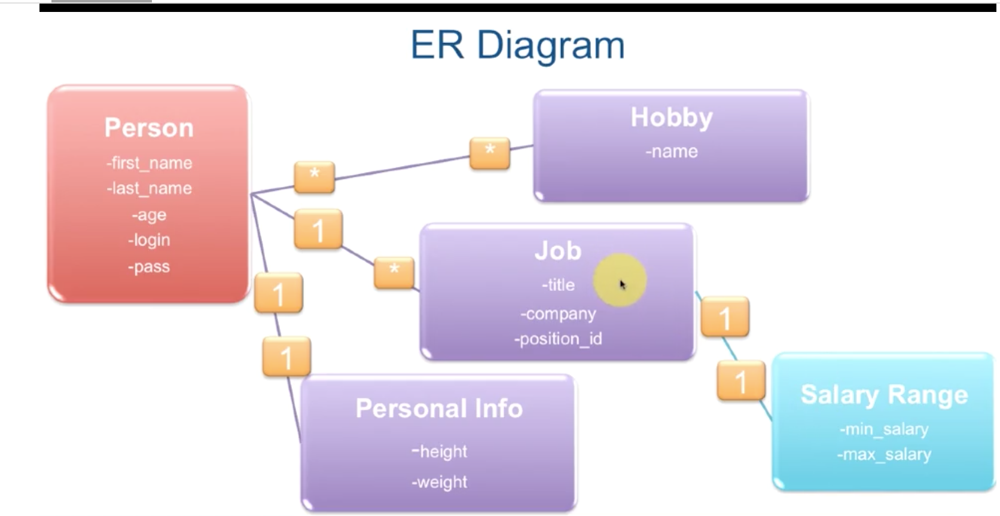

# Associations
In the following schema we have 3 different types of associations:

advanced schema: 

## One to One

One person has exactly one personal_info entry ('has_one'):
  class Person < ActiveRecord::Base
    has_one :personal_info
  end
One personal_info entry belongs to exactly one person ('belongs_to')
  class PersonalInfo < ActiveRecord::Base
    belongs_to :person
  end

The 'belongs to' side is the one with a foreign key
Convention:the default name for theforeign key is [master_table_singular]_id. eg: person_id

rails g model personal_info height:float weight:float person:references

We then have in a Person instance, the following 2 methods:
build_personal_info(hash)
create_personal_info(hash)

## One to Many

One person has one or more jobs ('has_many')
One job entry belongs to exactly one person ('belongs_to')

The 'belongs to' side is the one with a foreign key
Convention:the default name for theforeign key is [master_table_singular]_id. eg: person_id

rails g model job totle company position_id person:references


## Many to Many

One person can have many hobbies
One hobby can be shared by many people
habtm(has_and_belongs_to_many)
We need to create an extra table (aka join table), without a model, just a migration
Convention: for naming the join table, we use plural model names separated by an underscore in alphabetical order

The join table need to only exist in the database but not in Ruby code!


## :dependent
has_many, has_one and belongs_tosupport :dependent option which specifies what happens when the parent gets destroyed

1. :delete - remove associated objects
2. :destroy - same as above but removes the association by calling destroy on it
3. :nullify - set to null, leave the associated entity aline, just dissasociate it

## Documentation
[ROR Active Record Associations documentation](http://guides.rubyonrails.org/association_basics.html)

# Validations
It happens into the Model class definition

eg: in class Job
validates :totle, :company, presence: true

Here are some common validators:
:presence true - make sure the field contains some data
:uniqueness: true - a check is performed to make sure no record exists in the database (already) with the given valuefor the specified attribute
:numericality - validates numeric input
:length - validates value is a certain length
:format - validates value complies with some regular expression format
:inclusion - validates value is inside specified range

If and object is created and the the data is not validated, we can have the errors by using the .errors method:

```ruby
job = Job.new
job.save
job.errors_full_messages #=> ["Totle can't be blank", "Company can't be blank"]
```
.errors_full_messages gives an array of all the errors that currently exist that are preventing the object to been saved to the database

## Custom validators
Write a method that does some validation and calls errors.add(columnname, error) when it encounters an errors condition

Specify it as a symbol for the validate method

## Documentation
[ROR Active Record Validations documentation](http://guides.rubyonrails.org/active_record_validations.html)


Creating a rails app with a database with different associations commands suite:
----------------------------------------------------

rails new advanced_ar
cd advanced_ar
rails g model person first_name age:integer last_name
rake db:migrate

---fill the db/seeds.rb file

rake db:seed

rails g migration add_login_pass_to_people login pass
rake db:migrate


rails g model personal_info height:float weight:float person:references

rake db:migrate

# Add in the Person class the following code:
#   has_one :personal_info, dependent: :destroy

rails g model job totle company position_id person:references

rake db:migrate

# Add in the Person class the following code:
#   has_many :jobs
# you can also add
#   has_many :my_jobs, class_name: "Job" # and then we can query by: Person.first.my_jobs


rails g model hobby name
rails g migration create_hobbies_people person:references hobby:references

rake db:migrate
# Add in the last migration the following code:
# ,id: false
# because we do not want an id in the join table
# so that we have:
# create_table :hobbies_people, id: false do |t|

rails g model salary_range min_salary:float max_salary:float job:references

rake db:migrate

## Testing in Rails Console
jesus = Person.find_by first_name: "Jesus"
jesus.jobs.count
jesus.jobs.pluck(:id)
Job.find(2).create_salary_range(min_salary:10000.00, max_salary:20000.00)
Job.find(3).create_salary_range(min_salary:15000.00, max_salary:35000.00)
jesus.approx_salaries


Person.ordered_by_age.pluck :age
Person.ordered_by_age.starts_with("J").pluck :age, :first_name

